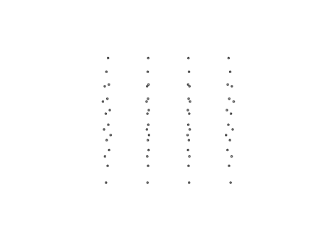
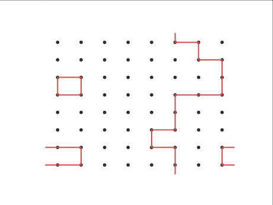

# Master thesis of Simon Rydell 2018

## Fractal dimension of geometric interpretations of the partition function in 2D Ising & 3D XY

For more information, please see [the thesis](thesis/thesis.pdf).

